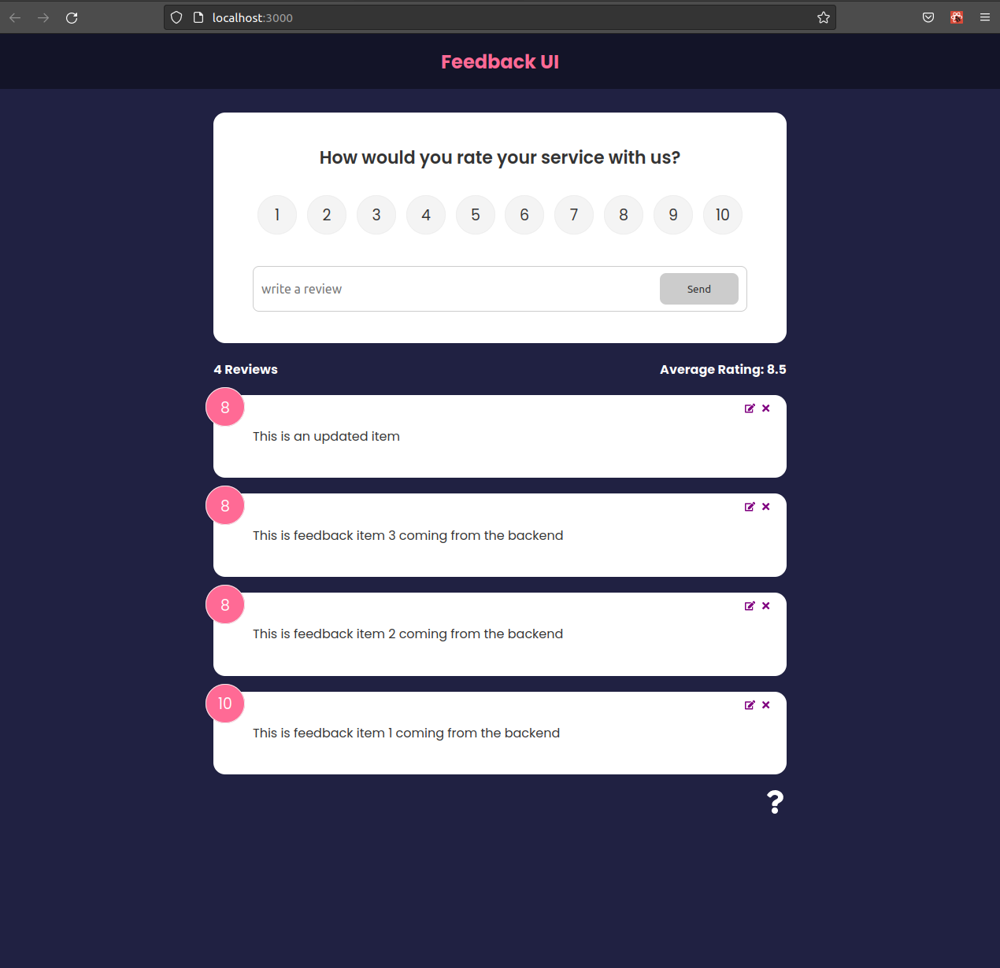

# React Feedback App

This is a project from [Bradtraversy's React Front To Back 2022 course.](https://www.udemy.com/course/react-front-to-back-2022/)  It allows users to add, update and delete feedback. It uses a mock REST api with json-server.

---



# Usage

## Install dependencies 
```shell
 npm install
```
## Run 
```shell
npm run dev
```
This will run JSON-server on port :5000 and React on port :3000